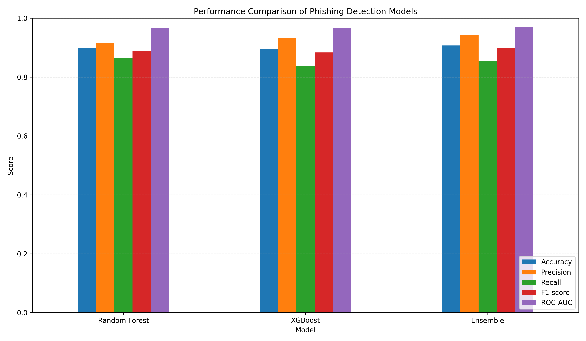
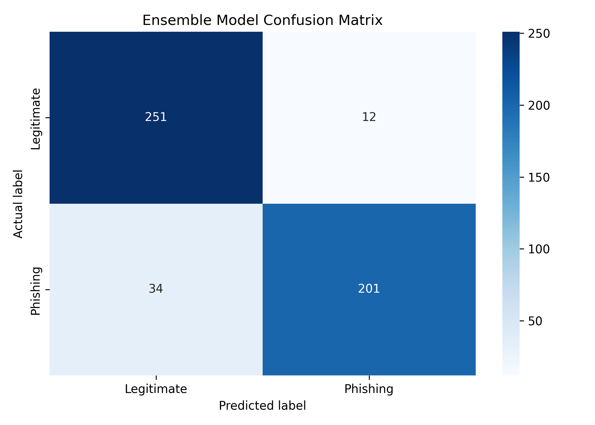

# 🛡️ Explainable Phishing URL Detection

### An Explainable Machine Learning Framework for Real-Time Phishing Website and URL Detection Using Ensemble Classifiers

[](https://www.python.org/)
[](https://scikit-learn.org/)
[](https://xgboost.readthedocs.io/)
[](https://streamlit.io/)
[](https://shap.readthedocs.io/)

> A machine learning-powered web application that analyzes URLs in real time and predicts whether they are potentially **phishing or legitimate**, while exposing the URL characteristics used for the prediction.

---

## 📌 Overview

Phishing attacks use deceptive URLs and websites to trick users into revealing sensitive information such as passwords, financial details, and personal credentials.

Traditional blacklist-based approaches can struggle with newly created or previously unseen phishing URLs.

This project explores a **machine learning-based approach to phishing URL detection** by extracting meaningful features from URLs and using an **ensemble classifier** to identify suspicious patterns.

The system provides an interactive web interface where a user can enter a URL and receive:

- 🔍 URL analysis
- 🧠 Machine learning prediction
- 📊 Phishing probability
- 🛡️ Safe/suspicious classification
- 🔬 Extracted URL features
- 💡 Explainability-oriented insights

---

# 🎯 Objectives

The primary objectives of this project are:

1. Detect potentially malicious URLs using machine learning.
2. Extract meaningful structural and lexical characteristics from URLs.
3. Improve classification using ensemble learning.
4. Provide real-time predictions through an interactive web application.
5. Evaluate the model using multiple validation strategies.
6. Improve transparency by exposing the features contributing to predictions.
7. Evaluate model behavior on external URL datasets.

---

# 🧠 How It Works

The application follows the following pipeline:

```text
                    ┌─────────────────────┐
                    │     User enters     │
                    │        URL          │
                    └──────────┬──────────┘
                               │
                               ▼
                    ┌─────────────────────┐
                    │   URL Validation    │
                    │   & Preprocessing   │
                    └──────────┬──────────┘
                               │
                               ▼
                    ┌─────────────────────┐
                    │   Feature           │
                    │   Extraction        │
                    └──────────┬──────────┘
                               │
                               ▼
                    ┌─────────────────────┐
                    │ Ensemble ML Model   │
                    │      Prediction     │
                    └──────────┬──────────┘
                               │
                    ┌──────────┴──────────┐
                    ▼                     ▼
             ┌─────────────┐       ┌─────────────┐
             │ Legitimate  │       │   Phishing  │
             │    URL      │       │     URL     │
             └─────────────┘       └─────────────┘
                    │                     │
                    └──────────┬──────────┘
                               ▼
                    ┌─────────────────────┐
                    │ Probability +       │
                    │ Extracted Features  │
                    └─────────────────────┘
## ✨ Key Features

- 🛡️ **Real-Time URL Detection** — Analyze a URL and receive an immediate phishing/legitimate prediction.
- 🔍 **Automated Feature Extraction** — Converts raw URLs into meaningful machine-learning features.
- 🤖 **Ensemble Machine Learning** — Uses a trained ensemble classifier for robust phishing detection.
- 📊 **Probability-Based Prediction** — Displays the model's estimated phishing probability.
- 🔬 **Explainable Predictions** — Allows users to inspect extracted URL characteristics behind the prediction.
- 🌐 **Interactive Web Interface** — Built with Streamlit for simple and accessible URL analysis.
- 🧪 **Model Evaluation** — Includes cross-validation, model comparison, confusion matrix analysis, and external evaluation.
- 🌍 **External Dataset Testing** — Evaluates model behavior on data outside the primary dataset.

## 🌐 Application Demo

The project provides an interactive web interface where users can enter a URL and receive an immediate prediction.

### Example: Legitimate URL

**Input**

```text
https://github.com

✅ The model does not flag this URL as suspicious.

Phishing probability:
0.00%

### 🖥️ Application Interface


### ✅ Legitimate URL Prediction


### 🚨 Phishing URL Prediction


## 🧠 Machine Learning Pipeline

The complete detection pipeline consists of the following stages:

```text
Raw URL
   │
   ▼
URL Preprocessing
   │
   ▼
Feature Extraction
   │
   ▼
Feature Vector
   │
   ▼
Machine Learning Models
   │
   ├── Random Forest
   │
   ├── XGBoost
   │
   └── Ensemble Classifier
   │
   ▼
Prediction Probability
   │
   ▼
Phishing / Legitimate
   │
   ▼
Feature-Level Interpretation

## 📊 Model Evaluation

The project evaluates the classification system using multiple complementary techniques.

### Evaluation Methods

- Accuracy
- Precision
- Recall
- F1-score
- Confusion Matrix
- Cross-Validation
- External Dataset Evaluation

### Model Comparison

The repository contains comparative evaluation results for the implemented machine learning approaches.



### Confusion Matrix



## 🔬 Explainable AI

A key objective of this project is to move beyond a simple binary prediction.

Instead of only answering:

> "Is this URL phishing?"

the system is designed to help answer:

> "What characteristics of this URL contributed to the prediction?"

The extracted URL features provide an interpretable representation of the input used by the machine learning model.

This explainability-oriented design can help researchers and security analysts understand model behavior, investigate suspicious URL characteristics, and improve trust in automated predictions.

### Why Explainability Matters

Cybersecurity decisions can have significant consequences. A transparent model can help users and analysts:

- Understand suspicious URL characteristics
- Investigate model predictions
- Identify potentially important features
- Debug unexpected classifications
- Improve confidence in machine learning-assisted security systems

## 📈 Results & Analysis

The repository includes experimental artifacts generated during model evaluation.

### Available Results

- Model comparison
- Confusion matrix
- Cross-validation analysis
- External evaluation
- Prediction results
- Feature analysis

These results are provided to make the experimental process reproducible and transparent.

## ⚠️ Limitations

The current system primarily focuses on URL-level characteristics.

A URL-based classifier may not capture every aspect of a malicious website. Sophisticated attacks can involve legitimate-looking URLs, compromised legitimate domains, redirects, dynamically generated content, or malicious page content.

Therefore, the system should be considered a machine-learning-assisted detection mechanism rather than a complete replacement for established cybersecurity defenses.

---

## 🚀 Future Improvements

Future development could extend the system with:

- 🌐 Website content analysis
- 🔐 SSL/TLS certificate analysis
- 🌍 DNS and domain-age information
- 🧠 Advanced deep learning models
- 🔎 Real-time threat intelligence feeds
- 🧩 Browser extension integration
- ☁️ Cloud/API deployment
- 🔄 Continuous model retraining
- 📊 Advanced SHAP visualizations
- ⚡ Real-time monitoring and alerting
