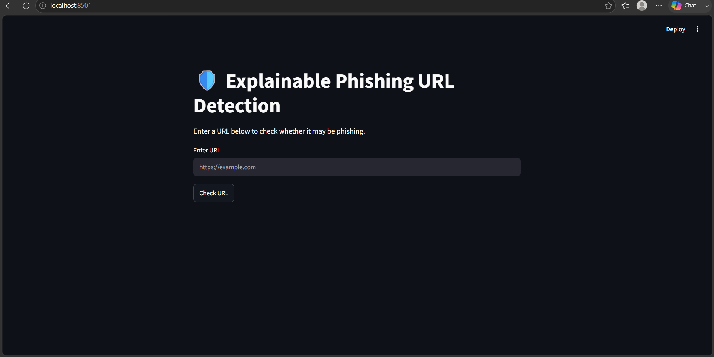
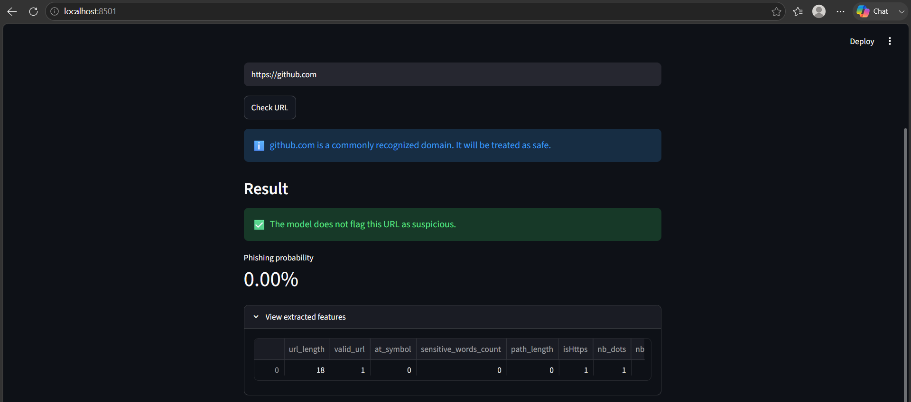
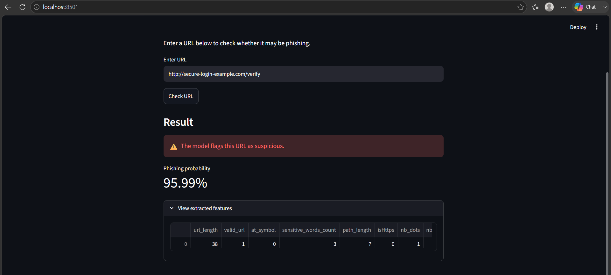

# 🛡️ Explainable Phishing URL Detection

<p align="center">

### 🔍 Detect. 🤖 Predict. 🔬 Explain.

**An Explainable Machine Learning Framework for Real-Time Phishing Website and URL Detection Using Ensemble Classifiers**

</p>

<p align="center">


</p>

---

## 🚨 **The Problem**

Phishing remains one of the most common cybersecurity threats.

Attackers can create deceptive URLs that imitate legitimate services and attempt to trick users into revealing:

🔐 Passwords  
💳 Financial information  
👤 Personal data  
📧 Account credentials  

The challenge is not simply detecting a malicious URL.

The bigger question is:

> **🧠 Can machine learning identify suspicious URL patterns while still providing useful information about the prediction?**

This project explores that problem through an **explainable machine learning pipeline for phishing URL detection**.

---

# 🎯 **Project at a Glance**

| 🔍 Component | 💡 Implementation |
|---|---|
| 🔗 Input | Website URL |
| 🧹 Processing | URL preprocessing & validation |
| 🔎 Feature Engineering | Structural & lexical URL features |
| 🤖 Classification | Ensemble Machine Learning |
| 🌳 Models | Random Forest, XGBoost & ensemble model |
| 📊 Output | Prediction + phishing probability |
| 🔬 Interpretation | Extracted feature analysis |
| 🌐 Interface | Streamlit Web Application |
| 🧪 Evaluation | Model comparison, cross-validation & external testing |

---

# 🌐 **Live Application Preview**

The project includes an interactive web application where users can enter a URL and receive a real-time prediction.

### 🖥️ **Detection Interface**



### 🟢 **Legitimate URL Analysis**



### 🔴 **Phishing URL Analysis**



---

# ✨ **Key Features**

### 🛡️ **Real-Time Phishing Detection**

Enter a URL and receive an immediate classification.

### 🔍 **Automated Feature Extraction**

Raw URLs are transformed into structured machine-learning features.

### 🤖 **Ensemble Machine Learning**

The application uses a trained ensemble classifier for final prediction.

### 📊 **Probability-Based Output**

The application provides a phishing probability alongside the classification.

### 🔬 **Explainability-Oriented Analysis**

Users can inspect extracted URL characteristics associated with the prediction.

### 🌍 **External Evaluation**

The repository includes an external evaluation workflow to investigate model behavior beyond the primary dataset.

### 📈 **Experimental Analysis**

Model comparison and confusion-matrix analysis are included as part of the evaluation pipeline.

---

# 🧠 **How the System Works**

The complete pipeline can be summarized as:

```text
                     👤 USER
                       │
                       ▼
                  🔗 Enter URL
                       │
                       ▼
               🧹 URL Processing
                       │
                       ▼
               🔍 Feature Extraction
                       │
                       ▼
                📊 Feature Vector
                       │
                       ▼
                 🤖 ML Models
                       │
              ┌────────┴────────┐
              ▼                 ▼
        🌳 Random Forest     🚀 XGBoost
              │                 │
              └────────┬────────┘
                       ▼
                🤖 Ensemble Model
                       │
                       ▼
                🎯 Prediction
                       │
             ┌─────────┴─────────┐
             ▼                   ▼
       🟢 LEGITIMATE         🔴 PHISHING
             │                   │
             └─────────┬─────────┘
                       ▼
                📊 Probability
                       │
                       ▼
                🔬 Feature View

🔍 URL Feature Engineering

A URL is not treated as a simple text string.

The system extracts meaningful characteristics that can help distinguish legitimate and suspicious URLs.

🧩 Feature Categories

| 🔎 Category              | 📌 Examples                        |
| ------------------------ | ---------------------------------- |
| 🔗 URL Structure         | URL length, path characteristics   |
| 🌐 Domain Structure      | Dots, subdomains, domain patterns  |
| 🔣 Special Characters    | `@`, `-`, `_`, `?`, `=` and others |
| 🔐 Security Indicators   | HTTPS-related characteristics      |
| 🖥️ Host Characteristics | IP-address based URLs              |
| 🔎 Query Characteristics | Query length and parameters        |
| 🧠 Lexical Patterns      | Character/token-level properties   |

These characteristics are transformed into a structured feature representation that can be consumed by the machine learning models.

🤖 Machine Learning Architecture

The project investigates multiple machine learning approaches for phishing URL classification.

🌳 Random Forest

A tree-based ensemble learning approach used to learn nonlinear relationships between URL characteristics.

🚀 XGBoost

A gradient boosting algorithm used to capture complex patterns within structured URL features.

🧠 Ensemble Model

The final application uses a trained ensemble classifier to generate the prediction presented to the user.
                     🔗 URL
                       │
                       ▼
               🔍 Feature Extraction
                       │
                       ▼
                 📊 Feature Vector
                       │
             ┌─────────┴─────────┐
             ▼                   ▼
      🌳 Random Forest       🚀 XGBoost
             │                   │
             └─────────┬─────────┘
                       ▼
                🤖 Ensemble Model
                       │
                       ▼
                 🎯 Final Result

🔬 Explainable AI

A major goal of this project is to move beyond a simple binary answer.
A conventional system might provide:
🔗 URL
  ↓
🔴 PHISHING
This project also exposes the extracted characteristics used during analysis.
🔗 URL
  │
  ▼
🔍 Feature Extraction
  │
  ├── 📏 Length characteristics
  ├── 🌐 Domain characteristics
  ├── 🔣 Special characters
  ├── 🔎 Lexical patterns
  └── 🔐 Security indicators
  │
  ▼
🤖 Ensemble Model
  │
  ▼
📊 Prediction Probability
  │
  ▼
🔬 Feature-Level Analysis

🔗 URL
  │
  ▼
🔍 Feature Extraction
  │
  ├── 📏 Length characteristics
  ├── 🌐 Domain characteristics
  ├── 🔣 Special characters
  ├── 🔎 Lexical patterns
  └── 🔐 Security indicators
  │
  ▼
🤖 Ensemble Model
  │
  ▼
📊 Prediction Probability
  │
  ▼
💡 Why Explainability Matters

In cybersecurity, a prediction can be more useful when analysts can investigate the characteristics behind it.

Explainability can help with:

🔎 Investigating suspicious URL patterns
📊 Understanding model behavior
🧪 Examining unexpected predictions
🛡️ Supporting security analysis
🧠 Improving trust in ML-assisted detection
🔬 Supporting future research

The objective is not only to detect phishing URLs, but to make machine-learning-assisted detection more understandable.

📊 Experimental Evaluation

The project includes several evaluation workflows designed to investigate model performance and behavior.

🎯 Evaluation Dimensions

| 📊 Evaluation       | 🎯 Purpose                           |
| ------------------- | ------------------------------------ |
| 🎯 Accuracy         | Overall classification performance   |
| 🎣 Precision        | Reliability of positive predictions  |
| 🔎 Recall           | Ability to identify phishing samples |
| ⚖️ F1-Score         | Balance between precision and recall |
| 🧩 Confusion Matrix | Detailed classification analysis     |
| 🔄 Cross-Validation | Model stability                      |
| 🌍 External Testing | Generalization analysis              |

Note: The repository contains the experimental result files rather than relying only on a single performance number.


